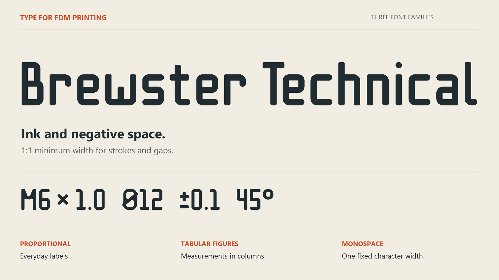
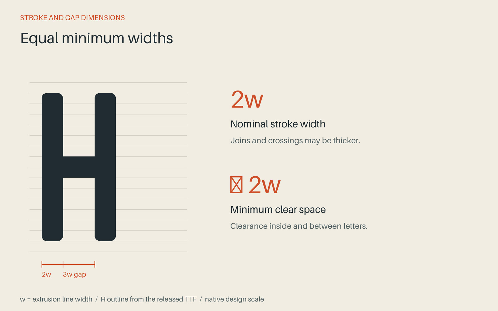
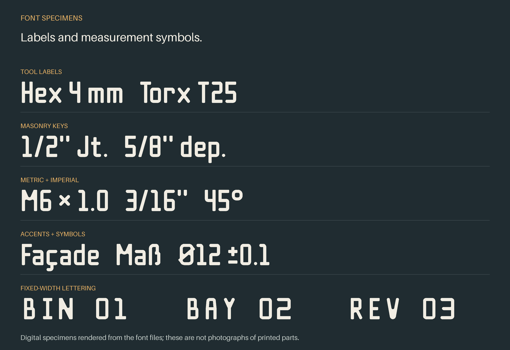
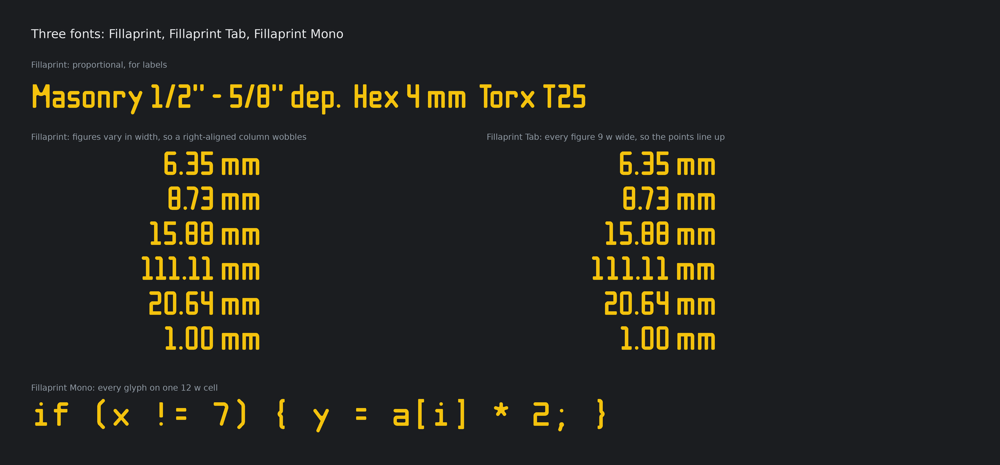
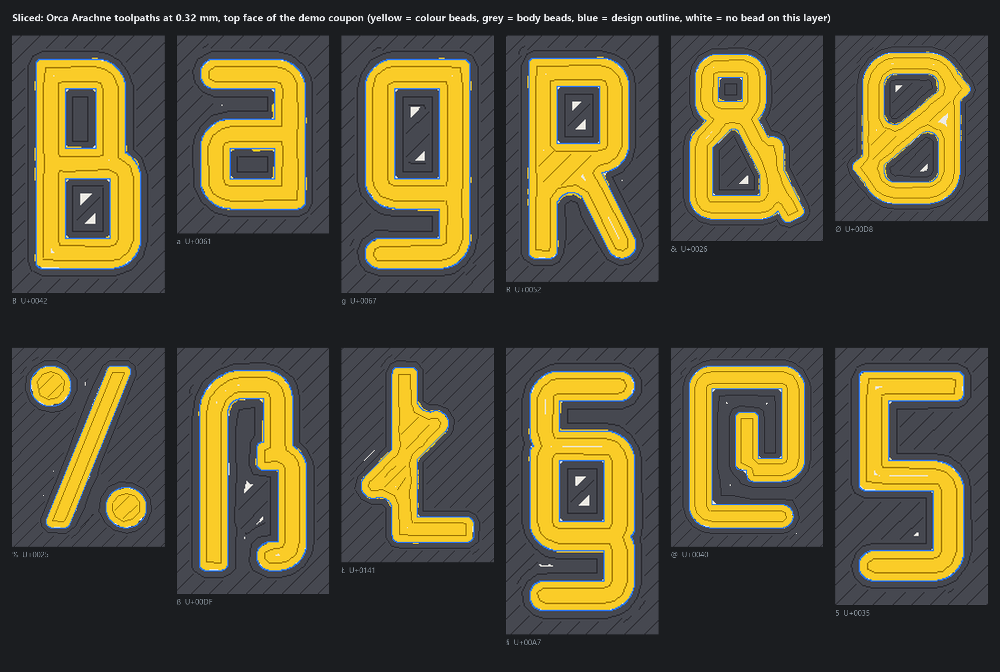

# Brewster Technical

**A typeface for FDM 3D printing.**

Brewster Technical gives the ink and the negative space proportional widths.
Uniform stroke width alone does not make a font easy to print: the gaps need
room for plastic, too. The aim is to reach the minimum printable size together,
without oversized features wasting space while the smallest gaps run out of
room for a line of plastic.

At its reference size, nominal strokes
are **two line widths thick**, and counters and clear gaps are designed to leave
**at least two line widths of room**. The material between the letters matters as
much as the letters themselves.

Made for tool labels, dimensions, storage bins, and multicolour lettering on printed
parts. Three TrueType families. Broad Latin coverage. Free for personal and
commercial use under the [SIL Open Font License](OFL.txt).

**[Live showcase and type tester](https://thereprocase.github.io/brewster-technical/)** · **[Get the fonts](#get-the-fonts)** · **[Choose a size](#size-it-from-your-line-width)** ·
**[Full character sheet](showcase/2-all-glyphs.png)** · **[License](#use-it-share-it-build-on-it)**

## Give the gaps room to print

Small text can look good in CAD and lose its shape in the slicer. Thin strokes
disappear, and the open spaces in letters such as **a**, **e**, **B**, and **8** can
close up when there is no room for the surrounding material.

Brewster Technical treats those spaces as part of the design. Its rounded corners, open
forms, and controlled spacing are built around a two-bead minimum. At crossings and
tight joins, extra material is preferable to a tapering sliver of empty space.

This gives the slicer a useful starting geometry. It does not override your print
settings: preview the toolpaths at the size and orientation you intend to print.

## From workshop labels to a full character set

The first job was lettering on masonry repointing keys: small, multicolour labels
that needed to remain legible on a useful tool. The family grew to include upper-
and lowercase letters, accented Latin characters, fractions, measurements, arrows,
and everyday punctuation.

These are digital specimens rendered from the actual TTF outlines and kerning.

## Get the fonts

| Download | Best for | Spacing |
| --- | --- | --- |
| [**Brewster Technical**](fonts/BrewsterTechnical-Regular.ttf?raw=true) | Labels and general lettering | Proportional, kerned |
| [**Brewster Technical Tab**](fonts/BrewsterTechnicalTab-Regular.ttf?raw=true) | Measurements and number columns | Proportional letters, equal-width digits |
| [**Brewster Technical Mono**](fonts/BrewsterTechnicalMono-Regular.ttf?raw=true) | Fixed-width layouts | All characters on a 12w cell |

Download a TTF and install it with your operating system's font installer. On
Windows, right-click the file and choose **Install**; on macOS, open it in Font Book.
On Linux, use your desktop's font manager. Restart CAD or design applications if
the family does not appear immediately.

When sharing the font files, include [OFL.txt](fonts/OFL.txt). The same license is
also embedded in each TTF. No license notice is required on the parts or artwork
you make with the font.

For an existing Windows installation, the optional
[installation script](tools/install_fonts.ps1) replaces older Brewster Technical
installs and unregisters the former Double bead and Beadjoint names. See its
parameters before running it.

The proportional and Tab families contain **376 drawn characters**, plus space and
alias mappings. Mono contains **362**: it narrows selected forms and omits 14 that
do not fit its cell. Tab includes a figure space (U+2007) for aligned numbers.

Coverage includes ASCII, Latin-1, Latin Extended-A, Romanian comma-below letters,
additional Welsh accents, capital ẞ, curly quotes, fractions, currency signs,
arrows, and selected mathematical symbols. It is a Latin-focused family; it does
not provide complete Greek or Cyrillic alphabets.

[View language specimens](showcase/3-languages.png) ·
[View symbols and figures](showcase/4-symbols.png) ·
[View every drawn character](showcase/2-all-glyphs.png)

## Size it from your line width

Start with **w**, the extrusion line width used for your text—not simply the nozzle
diameter. At the font's reference size:

| Measurement | Formula | w = 0.32 mm | w = 0.42 mm |
| --- | --- | --- | --- |
| Capital height / Fusion text Height | **14 × w** | **4.48 mm** | **5.88 mm** |
| Em-based font size | 20 × w | 6.40 mm | 8.40 mm |
| Nominal stroke / minimum clear gap | 2 × w | 0.64 mm | 0.84 mm |
| Default line pitch | 28 × w | 8.96 mm | 11.76 mm |

**Example:** for a 0.42 mm extrusion width, start with a 5.88 mm capital height.
In Fusion, that is the text **Height**. In an application that sizes text by the em,
use 8.40 mm instead. If unsure, convert an **H** to outlines and measure it.

Scaling up gives the slicer more room and may add beads. Scaling down removes the
two-bead margin. Keep the default line spacing for accents and descenders, and
check counters in the sliced preview before printing.

[Detailed sizing and the recorded slicer setup →](docs/PRINTING.md)

## See the toolpaths

This recorded visualization shows the top face of the demo coupon, sliced with
OrcaSlicer's Arachne wall generator at **w = 0.32 mm**. Yellow is the lettering
material, grey is the body material, blue is the design outline, and white marks
areas without a bead on that layer. It is a toolpath render, not a photograph.

The development tools check stroke geometry, spacing, and the outlines read back
from the generated TTFs. The companion coupon workflow also measures sliced
coverage, voids, and bleed. See the [construction specification](docs/SPEC.md) and
[build instructions](docs/DEVELOPMENT.md) for the checks and their limits.

## Use it, share it, build on it

Brewster Technical uses **SIL OFL 1.1**, with its family names reserved.

- **Commercial use is welcome.** Use it on products, in client work, on websites,
  and in documents. The work you create does not have to use the OFL.
- **Modifications are welcome.** Keep the copyright notice and license with
  distributed fonts; distribute derivative font software under the OFL.
- **Keep the original identity clear.** Distributed modified versions must use
  different names unless you have written permission to use the Reserved Font Names.
- **Do not sell the font by itself.** The OFL permits bundling it with software.

If you build on this font, please acknowledge its origins and describe what you
changed. Contributions and fixes are welcome. That request is community guidance;
the OFL itself permits both minor and substantial modifications.

[Full license](OFL.txt) · [Plain-language licensing notes](docs/LICENSING.md)

---

Designed by [Repro](https://github.com/thereprocase). Previously called **Double
bead**, after two extrusions laid side by side. The original working name,
**Beadjoint**, also nods to a mortar-joint profile; it remains the name of the
Python source package. The repository URL retains `double-bead`.
