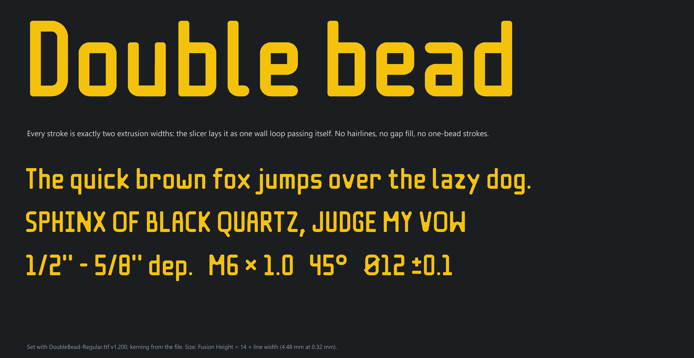
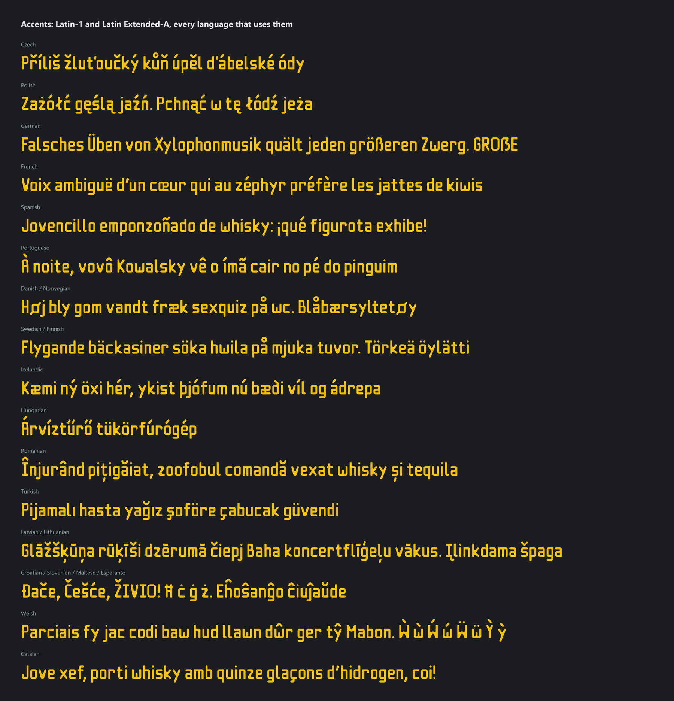
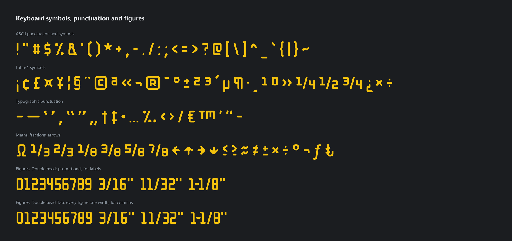

# Double bead

**A font the slicer can't ruin.**



Double bead is a typeface drawn for FDM printing, not for screens. It is drawn on the extrusion grid:
every stroke is exactly **two extrusion widths** wide, and every gap, counter and hole is **at least two
extrusion widths** wide. An Arachne slicer lays each stroke as one wall loop passing itself, and each
gap prints as two clean beads of the other colour. There are no hairlines, no one-bead strokes, no gap
fill, and no counters that close up into a blob.

It was drawn for the multi-colour labels on masonry repointing keys, small text on tools that has to
read, and it grew into a full Latin font: **376 characters** in three families.

## Why this exists

Ordinary fonts fail at small print sizes in predictable ways:

- **Thin strokes** end up one bead wide, or the slicer drops them.
- **Round strokes** get filled with gap-fill zig-zags.
- **Counters close up**: e, a, 8 and B turn into blobs, because the slicer can't fit a bead of the
  other colour into the gap.

That last one is the one that matters. Uniform stroke width is not new: single-line engraving fonts,
OCR and DIN-style fonts, and stencil fonts all have it. What none of them guarantees is the
**negative space**. In Double bead the space between strokes gets the same two-bead minimum as the
strokes themselves. That is the difference between text you can read on a printed part and a
yellow smudge.

When the two rules conflict at a joint or crossing (X, K, N, filled pinches), the letter keeps extra
ink rather than keeping a thin or tapering gap. A slightly heavy join still reads. A lost counter does
not, and neither does colour that fails to bond because the gap tapered to nothing.


*Orca Arachne toolpaths at 0.32 mm on the top face of the demo coupon. Yellow = colour beads,
grey = body beads, blue = design outline.*

## Size it from your line width

The font is drawn in line widths (**w**). Take w from the line width your slicer uses for the outer wall
and top surface. Then:

| What you set | Value | At w = 0.32 mm | At w = 0.42 mm |
|---|---|---|---|
| **Fusion text Height** (Fusion sizes text by cap height) | **14 × w** | **4.48 mm** | 5.88 mm |
| Font size in programs that size by em (CadQuery, Inkscape, OpenSCAD, most slicers) | 20 × w | 6.40 mm | 8.40 mm |
| Font size in points | 20 × w ÷ 0.3528 | 18.1 pt | 23.8 pt |
| Stroke | 2 × w | 0.64 mm | 0.84 mm |
| x-height | 10 × w | 3.20 mm | 4.20 mm |
| Line pitch (the fonts' default) | 28 × w | 8.96 mm | 11.76 mm |

**That size is the minimum, not the only size.** The design is proportional, so scaling it up
scales every stroke and every gap together. Nothing turns into a small detail inside a big letter,
and bigger text is always safe. Smaller is never safe: the strokes drop under two beads.

Fusion check (2026-09-23): sketch text "H" at Height 10 mm in Arial and Consolas measures exactly
10.000 mm, so Height is the cap height. Double bead's cap height (OS/2 `sCapHeight`) is 700 units
= 14 w.

About the 28 w line pitch: it keeps accents, brackets and commas 2 w clear of the line above in any
text (g over ( needs 22 w, p over Á 26.4 w, g over Å 28 w). 20 w is safe only for unaccented text
without brackets, or descenders over capitals, such as two-line tool labels.

## The families


| File | Family | Use |
|---|---|---|
| `fonts/DoubleBead-Regular.ttf` | Double bead | Fully proportional and kerned. **Best for labels.** |
| `fonts/DoubleBeadTab-Regular.ttf` | Double bead Tab | Tabular figures on 9 w cells, for numbers stacked in columns; U+2007 figure space aligns them. |
| `fonts/DoubleBeadMono-Regular.ttf` | Double bead Mono | Monospace on 12 w cells. It uses narrow forms of æ œ Æ Œ ø Ø « » — IJ Ω, and leaves out the 14 glyphs still wider than 10 w (© ® ™ ‰, the fractions, ʼn). |

Side bearings are never under 1 w, so even a program that ignores kerning keeps every pair of glyphs
2 w apart. The kerning (GPOS, plus a legacy `kern` table for the ASCII pairs) tucks overhangs in
pair by pair and keeps accents 2 w clear of their neighbours.

### Coverage

A–Z and a–z, all ASCII symbols, Latin-1, Latin Extended-A, Romanian comma-below letters, Welsh
ẁ ẃ ẅ ỳ, capital ẞ, dashes, curly quotes, primes, euro, lira, florin, trade mark, fractions (halves,
thirds, quarters, eighths), superscripts, arrows, and ≤ ≥ ≈ ≠. That covers every common European
keyboard layout and every Latin-script European language.





## Install

**Windows**, per user, no admin rights:

```powershell
powershell -NoProfile -ExecutionPolicy Bypass -File tools\install_fonts.ps1 -Version 1.200 -Source <repo>\fonts
```

The script:
- installs the three TTFs under a versioned file name, registers them in HKCU and loads them into
  the session;
- removes earlier installs, including the ones under the old working name, Beadjoint.

Restart programs that read the font list only at start (Fusion does).

**Elsewhere:** install the three files in `fonts/` the usual way.

## The rules

- No ink narrower than 2 w anywhere.
- No enclosed hole narrower than 2 w. Separate pieces (dots, accents) sit at least 2 w apart.
- Negative-space pinches narrower than 2 w are filled. Inside and outside corners are rounded to
  R0.5 w.
- Wider spots (crossings, filled joints) are allowed; they print with extra beads or infill.
- In a set line, every glyph is at least 2 w (1.98 after font rounding) from each of the next three.

The full reproducible specification (units, guides, the Arachne bead model, the glyph construction,
the three settings and the checks) is in [docs/SPEC.md](docs/SPEC.md).

## Slicer profile

The font assumes Arachne walls, with the minimum bead width low enough that a thick joint steps up
to a third bead instead of leaving a void. The tested text profile, for a 0.3 mm nozzle declared as
0.4 in the slicer (w = 0.32 mm), is:

| Setting | Value |
|---|---|
| `wall_generator` | `arachne` |
| `min_bead_width` | `50%` |
| `initial_layer_min_bead_width` | `50%` |
| `wall_transition_angle` | `45` |

Transition length and filter deviation are scaled to the real nozzle. On other nozzles, keep the
minimum bead width near 0.6 w and the transition angle at 45.

## Build and verify

The scripts need Python 3.12 with `shapely`, `fontTools`, `numpy`, `scipy` and `Pillow`. The
commands below say `cadpy`: that is the author's wrapper for that Python on Windows, and any Python
with those packages works.

```sh
cadpy build.py                             # fonts/*.ttf, specimen/*.png, report.json
cadpy -m unittest discover -s tests        # regression tests (10 tests, about 2 minutes)
cadpy tools/showcase.py                    # showcase/*.png, drawn from the built TTFs
cadpy site/build_site.py                   # site/dist: browser specimen with a size calculator
cadpy site/serve.py                        # serves site/dist on port 8765
```

`build.py` exits 1 unless every check passes:

- **Every glyph** of the proportional and monospace sets, and the tabular 1: thickness ≤ 2.85 w and no
  thin pieces. The spec's reference results reproduce: the maximum is 2.83 w, at the f and t
  crossings.
- **Outline read-back:** every outline read back from each TTF lies within 1.5 font units of its
  source glyph.
- **Set lines:** checked in all three settings, from the source geometry and from each TTF's own
  metrics and kerning. Every neighbour pair is ≥ 1.98 w apart.
- **Setting fidelity:** each TTF reproduces its setting engine, with every gap within 0.13 w.

`demo/demo_plate.py` and `demo/demo_check.py` go one step further and slice every glyph at native
size on a two-face coupon in OrcaSlicer. They report coverage, voids, bleed and single-bead strokes
per glyph, with a bead-level render of each. These two scripts depend on OrcaSlicer and the
companion masonry-keys project (3MF helpers and the text profile).

## What's in here

| Path | What |
|---|---|
| `beadjoint/` | Glyph geometry, accents and marks, the setting engine, the checks, and the TTF writer. It keeps the working name. |
| `fonts/` | The built TTFs (v1.200). |
| `docs/SPEC.md` | The two-bead font specification. |
| `showcase/`, `specimen/` | Showcase images, a specimen and a stroke-thickness map. |
| `site/` | Static browser specimen and size calculator. |
| `demo/` | Slice-and-check tooling for the demo coupon. |
| `review/` | The design log (`LOG.md`), one entry per review round, with the renders and print photos behind each decision. |

## The name

Every stroke is a double bead: two extrusions laid side by side. The working name was **Beadjoint**,
because a bead is also a mortar-joint profile, and the first job was labelling masonry keys. The Python
package and the design log still carry that name.
